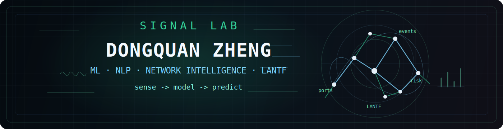

<h1 align="center">Dongquan Zheng</h1>

<p align="center">
  <code>machine learning</code> &middot;
  <code>NLP signals</code> &middot;
  <code>network intelligence</code> &middot;
  <code>empirical systems</code>
</p>

<p align="center">
  <sub>MSc Data Science and Society @ Tilburg University &middot; MSc International Business @ University of Queensland</sub>
</p>

## >_ Lab coordinates

| Mode | Signals |
| --- | --- |
| sense | public events &middot; ports &middot; networks &middot; weak signals |
| model | LANTF &middot; ML &middot; NLP &middot; network features &middot; diagnostics |
| predict | risk &middot; disruption &middot; change |

## >_ Site dossier

AI systems for sensing, modeling, and predicting a changing world.

My current work sits between data science, empirical business research, and operational risk. Supply-chain prediction is one important track, but the larger interest is AI-assisted sensing: turning messy traces into features, networks, and testable predictions.

I use this space for research prototypes, empirical analysis tools, signal pipelines, and some strange practical instruments that orbit the same question: what can machines notice before people can clearly name it?

## >_ Current projects

| Project | Focus |
| --- | --- |
| LANTF / Layered Adaptive Network framework | A broader framework direction for combining graph structure, network ML, NLP event signals, and future adaptive sensing methods. |
| [event-informed-port-disruption-modeling](https://github.com/DongquanZheng/event-informed-port-disruption-modeling) | Port disruption modeling with operational activity data and NLP-derived event signals. |
| [DataCo-Late-Delivery-Prediction-and-Explainability](https://github.com/DongquanZheng/DataCo-Late-Delivery-Prediction-and-Explainability) | Supply-chain late-delivery risk prediction with explainability, leakage-aware workflow thinking, and empirical ML practice. |
| [reg_monkey](https://github.com/DongquanZheng/reg_monkey) | A no-login empirical analysis assistant for business, economics, and management research workflows. |
| Strange tools | Small side instruments for monitoring, interaction, local assistants, embedded controllers, and practical prototypes. |

## >_ Research direction

- AI-assisted sensing for public events, ports, supply chains, and networks.
- LANTF: graph structure, network ML, NLP signals, and adaptive sensing methods.
- Event-informed machine learning for disruption and risk prediction.
- NLP event data pipelines for weak-signal extraction from public information environments.
- Empirical automation for cleaner data work, diagnostics, and reproducible workflows.

## >_ Technical stack

```text
Python              pandas              scikit-learn
statsmodels         XGBoost             Random Forest
Jupyter             Streamlit           NLP event data
feature engineering regression checks   network analysis
C++ / embedded      automation scripts  research prototypes
```

## >_ Contact

- GitHub: [DongquanZheng](https://github.com/DongquanZheng)
- Email: [zhiweixuqiu@163.com](mailto:zhiweixuqiu@163.com)
- Signal fit: supply-chain analytics, networked disruption, event signals, empirical ML, and research automation.

Quiet signals, useful systems, evidence first.
